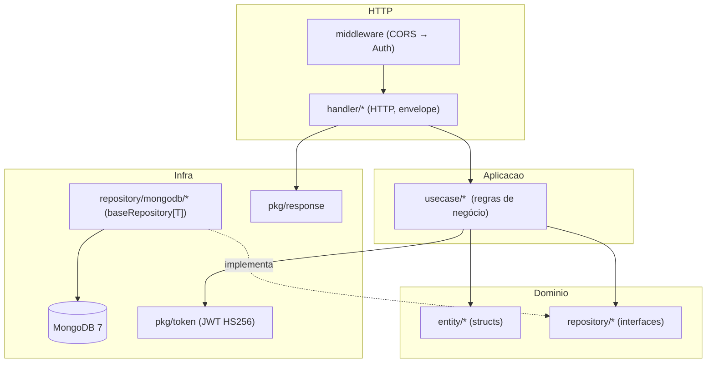
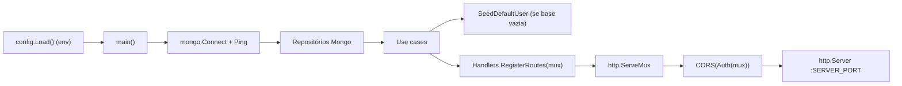

# Arquitetura do Backend

Clean Architecture em Go 1.25, `net/http` puro (pattern matching nativo),
MongoDB 7, JWT HS256 próprio (stdlib) e bcrypt.

## Camadas e dependências



Regra: dependência sempre de fora para dentro. `usecase` depende das **interfaces**
de repositório (`internal/domain/repository`), nunca da implementação Mongo.

## Wire (composição em `cmd/server/main.go`)



## Estrutura de pastas (real)

```
app/
├── cmd/server/main.go              # composição e bootstrap
├── config/config.go                # carga de env (Config)
├── internal/
│   ├── domain/
│   │   ├── entity/                 # user, course, study, project, culinary, quiz
│   │   └── repository/             # interfaces + erros de domínio
│   ├── usecase/                    # auth, course, study, project, culinary, quiz
│   ├── handler/                    # HTTP handlers + helpers (map erro→status)
│   ├── repository/mongodb/         # baseRepository[T] + repos concretos
│   └── middleware/                 # auth.go, cors.go
├── pkg/
│   ├── token/                      # JWT HS256 (stdlib) + token_test.go
│   └── response/                   # helpers de resposta
├── docker/mongo-init.js            # collections + índices
├── Dockerfile                      # multi-stage golang:1.25-alpine → alpine:3.21
├── docker-compose.yml              # api + mongo + mongo-express
├── Makefile                        # run/build/test/docker
└── .env.example
```

## Middlewares

- **CORS** (`internal/middleware/cors.go`): libera origens (restringir em produção).
- **Auth** (`internal/middleware/auth.go`): exige `Authorization: Bearer <jwt>` em
  todo `/api/v1/*`. Públicas: `/health` e `/api/v1/auth/*`.

Ordem aplicada: `CORS(Auth(mux))` — CORS é o mais externo.

## Contrato de resposta

```json
{ "success": true,  "data": { } }
{ "success": false, "error": "mensagem" }
```

`GET /health` é a exceção: retorna `{ "status": "ok", "service": "<db>" }` puro.

## Decisões técnicas relevantes

- **Sem framework web**: `net/http` com roteamento por método+padrão (Go 1.22+).
- **JWT stdlib**: evita dependência externa; HS256 assinado com `JWT_SECRET`.
- **`baseRepository[T]` genérico**: concentra list/get/insert/update/delete.
- **Seed idempotente**: admin criado só quando a collection `users` está vazia.
