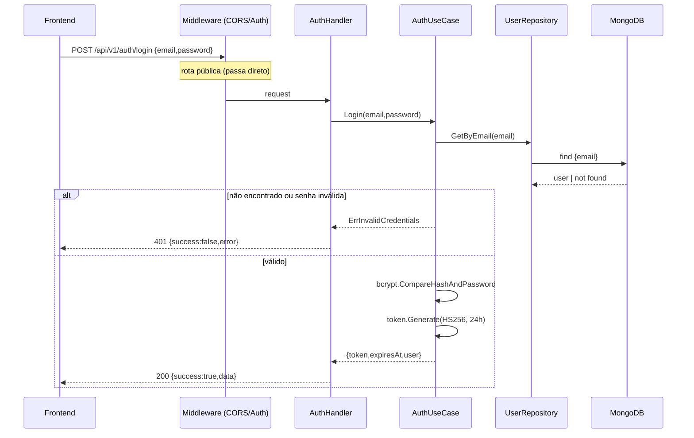
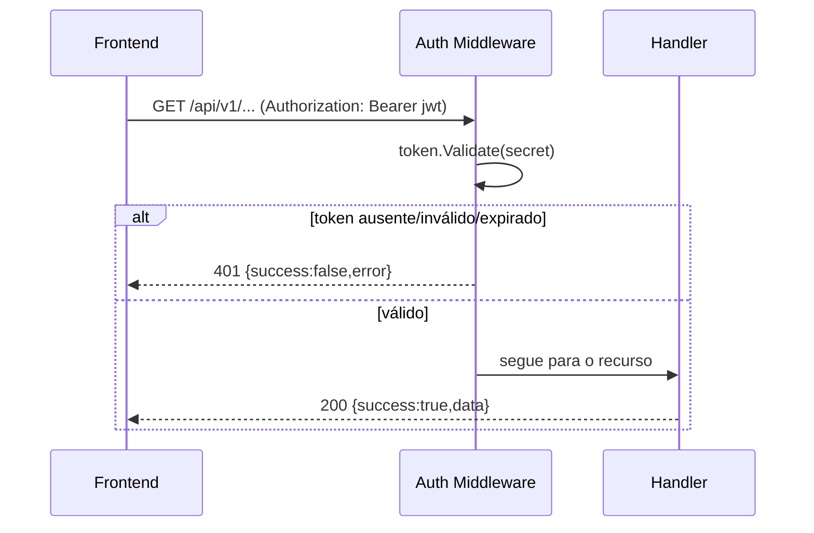
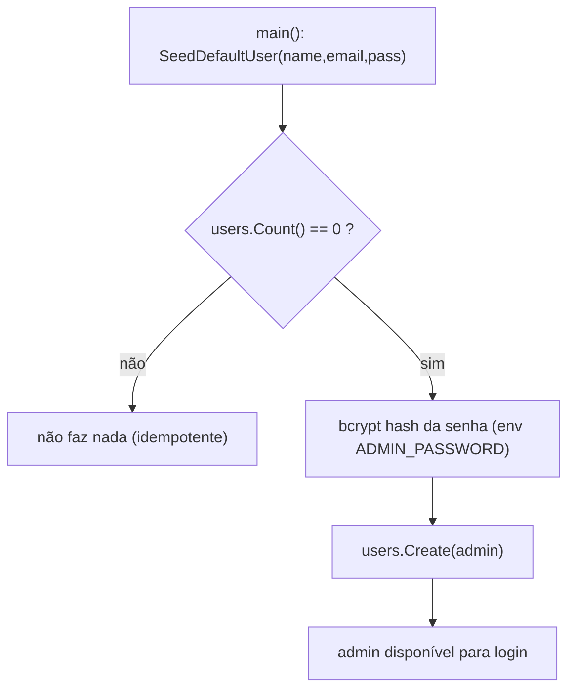
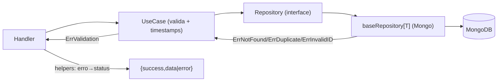
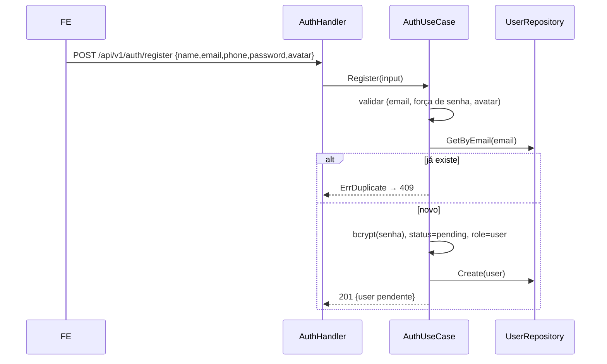
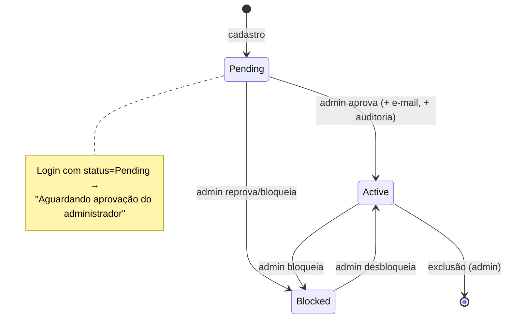
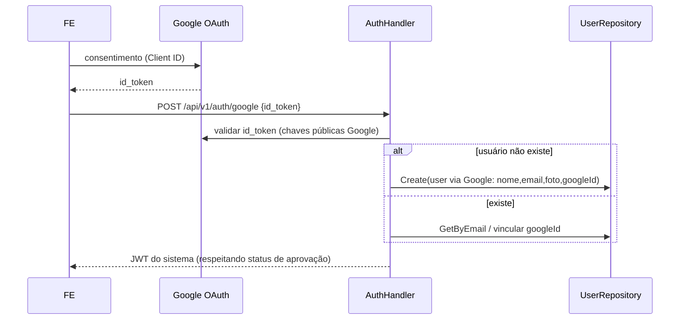

# Fluxos do Backend

Fluxos reais (implementados) e planejados (marcados). Diagramas em Mermaid.

## 1. Autenticação — Login (implementado)

## 2. Requisição autenticada a rota protegida (implementado)

## 3. Seed do administrador (implementado)

## 4. CRUD genérico de recurso (implementado — ex.: study_items)

## 5. Cadastro de usuário (implementado)

## 6. Fluxo de aprovação de usuário (implementado, exceto envio de e-mail)

## 7. Login com Google OAuth (planejado / bloqueado por credenciais)

Requisitos externos: `GOOGLE_CLIENT_ID`/`GOOGLE_CLIENT_SECRET` (env). Registrado
como pendência — ver `docs/swagger-openapi.md` e a doc do módulo de identidade.
