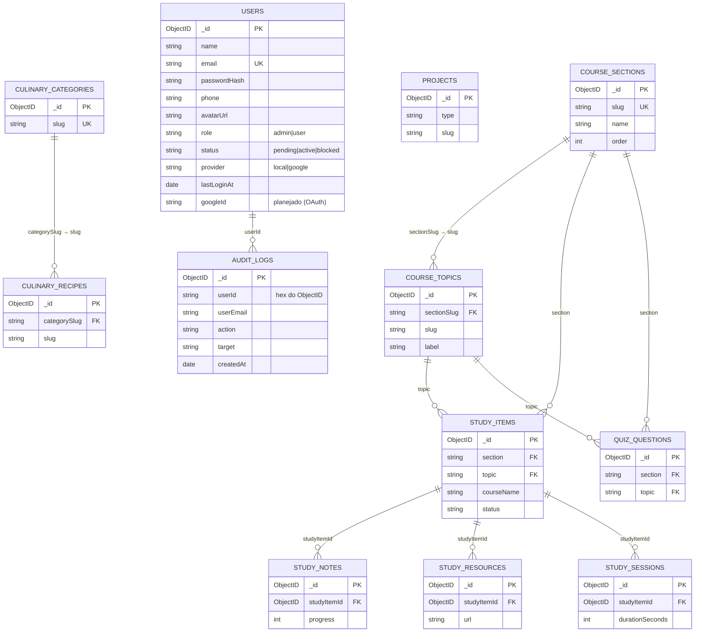

# Relacionamentos entre Entidades — Backend

Os relacionamentos são **lógicos** (referências por `slug` ou `ObjectID`), pois o
MongoDB não impõe chaves estrangeiras. A aplicação garante a consistência.

## Diagrama Entidade-Relacionamento (Mermaid)

## Cardinalidades

| Relação | Cardinalidade | Chave | Regra |
|---|---|---|---|
| Área → Tópicos | 1:N | `course_topics.sectionSlug` = `course_sections.slug` | tópico pertence a uma área |
| Área/Tópico → Itens de estudo | 1:N | `study_items.section`/`.topic` | item referencia área e tópico |
| Item de estudo → Notas | 1:N | `study_notes.studyItemId` | notas do item |
| Item de estudo → Recursos | 1:N | `study_resources.studyItemId` | recursos do item |
| Item de estudo → Sessões | 1:N | `study_sessions.studyItemId` | sessões registradas |
| Área/Tópico → Quiz | 1:N | `quiz_questions.section`/`.topic` | perguntas por trilha |
| Categoria → Receitas | 1:N | `culinary_recipes.categorySlug` = `culinary_categories.slug` | receita de uma categoria |
| Usuário → Audit logs | 1:N | `audit_logs.userId` | trilha de auditoria (implementado) |

## Integridade referencial (responsabilidade da aplicação)

- Ao excluir uma área/tópico/item, avaliar órfãos (hoje não há cascade automático).
- `slug` e FKs por slug são imutáveis em update (protegidos no repositório).
- Unicidade garantida por índices (`email`, `slug`, `sectionSlug+slug`).
